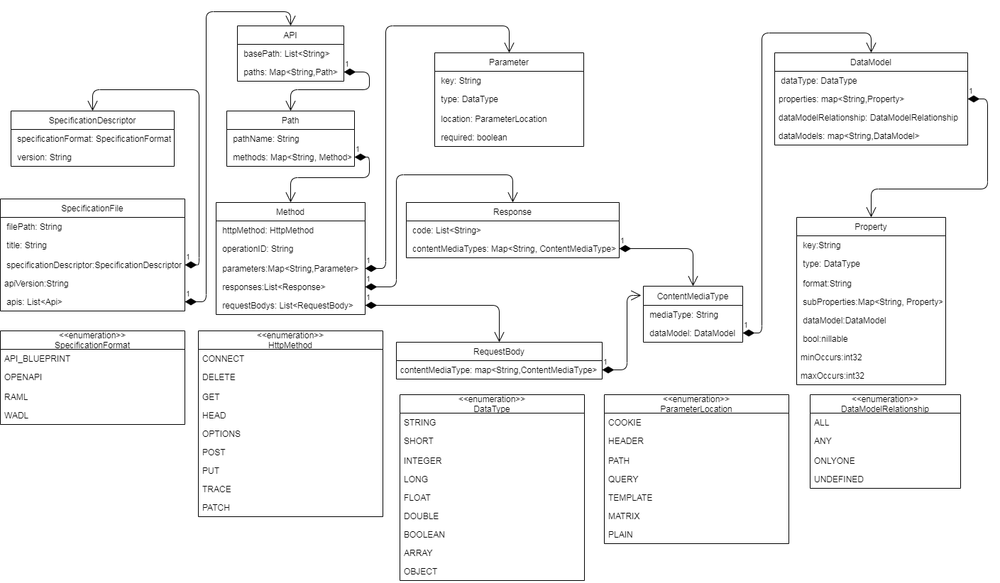

# RAMA CLI Development Guide
> This document contains the most important information for developers who want to understand and extend RAMA.

## General Architecture

### UML Sequence Diagram
Description of the tools behavior if it is started via command-line.


#### Main
Entry point of the tool. Command-line [options](../README.md#Command-Line-Options) are detected and passed to the `ApplicationService`.

#### ApplicationService
The `ApplicationService` is responsible for creating:
* `RestfulSystem` 
* `RestfulService`
* `Evaluation`
* `Measurement`

| Class            | Responsibility                                                                                                                                                                                                             |
| :--------------- | :------------------------------------------------------------------------------------------------------------------------------------------------------------------------------------------------------------------------- |
| `RestfulSystem`  | One system can consist of multiple services. This entity is used to store the system name and a list of `RestfulServices`. This is not used in the CLI. Can be used in combination with the [other tools](#Other%20Tools). |
| `RestfulService` | Represents a single specification file. Can store meta data like a name or the file URL. Also stores a list of `Evaluations`. This entity is later used by the `RestfulServiceMapper` to generate PDF or JSON files.       |
| `Evaluation`     | Contains multiple `Measurements` and also other meta data.                                                                                                                                                                 |
| `Measurement`    | Represents the concrete values for a single metric.                                                                                                                                                                        |


#### Parsers
All Parsers inherit from the `Parser.java` class.
The Parser are responsible for transforming specification files from each format to our [Internal API Model](#Internal%20API%20Model)

#### Internal API Model

Each parser has to parse a given API specification into the internal model for the evaluation. The internal model consists of the following 11 classes.
1. `SpecificationFile`: Contains the meta-information of the file.
2. `SpecificationDescriptor`: Contains the format and the version of the format of the file.
3. `API`: Contains the base `Path` and a `Path` for each individual endpoint of the API.
4. `Path`: A `Path` object contains the name of the path and a list of all methods the endpoint provides.
5. `Method`: Each `Method` object should have its HttpMethod defined and contains a list of all `Parameters`, `Responses` and `RequestBodies` it contains. Additionally, an `operationID` must be provided. Should the API specification language not require a `operationID`, you can use an incrementing integer for this variable.
6. `Parameter`: A `Parameter` object should provide its name as the key (the same value that has been used as key in the `Parameter` map), the data type of the `Parameter`, where the `Parameter` was specified and if it is required or not.
7. `Response`: Each `Response` object contains the codes for which the `Response` is send and the possible content media types contained in the `Response`.
8. `RequestBody`: Each `RequestBody` object has all the possible `ContentMediaTypes` it contains.
9. `ContentMediaType`: Each `ContentMediaType` object has its media type as a String and a `DataModel` object.
10. `DataModel`: A `DataModel` object has a data type which is usually either object or array, a map of `Properties` contained in it, a `DataModelRelationship` object and a list of child `DataModel` objects.
`DataModelRelationship` is required if the data schema uses a modifier like `oneOf`, `allOf`, or `onlyOne`.
11. `Property`: A `Property` has its name as a key (the same value that has been used as key in the `Properties` map), the `DataType` of the property, the format of the property, a list of child `Property` objects and it can also contain a `DataModel` object. `Properties` which themselves contain more properties have to be listed under sub properties as well. Furthermore, a property contains a `boolean` which defines whether or not this property can be null and the two `int` values `minOccurs` and `maxOccurs`. The `DataModel` of a `Property` is used when it is defined by a schema that uses `oneOf`, `allOf`, or `onlyOne`.

## How to add new parsers?
To add a new parser, create a new class that inherits from the abstract `Parser.java` class. The `Parser` class provides the two methods `loadPublicUrl` and `loadLocalUrl`, which return a `SpecificationFile` object. At least one of these methods should be overridden and used as an entry point for the parser. Furthermore, the `Parser` has to parse all relevant information of the given API specification into the returned SpecificationFile object. Lastly, the `ParserType.java` has to extended with a new `ENUM` and a new `case` has to be added to the `switch` statement.

## How are existing parsers implemented and how could they be modified?

The tool currently has 3 parsers that are described as follows:
* [OpenAPI V3](parsers/oapi3.md)
* [RAML](parsers/raml.md)
* [WADL](parsers/wadl.md)

## How to add or modify metrics?
To extend the tool with additional metrics, create a new class that implements the `IMetric` interface. The interface contains all methods expected by the tool. JUnit tests for new metrics should also be implemented and all required specification files for a specific metric test should be copied in a new `src/test/resources/metrics/...` folder so that it is easier to maintain metrics.

In order to use the available `web-app-api` project as a backend for the Vue.js frontend, make sure that each new metric also has an `ini` file in the `src\main\resources\metric-ini` folder. Four keys for the `[thresholds]` section and one for the `[colorDistribution]` section are expected. In `[thresholds]`, set the keys for the absolute color scheme used in the frontend. The lower and upper bound of the colors red and green are to be determined. The `boolean` key `maxGreen` in `[colorDistribution]` determines if the highest value is presented green and the lowest value is presented red or vice versa.

## How to extend the internal API model?
To modify the internal model, the ProtoBuf file in `src/main/proto` has to be adjusted. While new properties can simply be inserted, a new class has to be defined as a new message. The official [language guide](https://developers.google.com/protocol-buffers/docs/proto3) is a more elaborate starting point to familiarize yourself with ProtoBuf. Currently the proto sources have to be compiled manually, which is done by invoking the [Protocol Compiler](https://developers.google.com/protocol-buffers/docs/downloads.html) as follows:

```bash
protoc --proto_path=./src/main/proto --java_out=./src/main/java model.proto
```

At a later point, this build process should probably be automated via Maven.
The generated Java class holds `Builder` factories for all defined messages with the appropriate getters and setters. After an object has been built, it has to be casted back to a builder to allow for further modifications. The [official tutorial](https://developers.google.com/protocol-buffers/docs/javatutorial) is more exhaustive.

It is strongly advised to check all existing metrics for needed adjustments and especially incorporate the updated model into all implemented parsers. Changes to the internal data model technically necessitate adjustments to either parsers or metrics. Only a rigorous checking will maintain the correctness of calculated metrics.

## Metrics
The tool currently has 10 metrics that are described as follows:
* [Argument per Operation (APO)](metrics/ArgumentsPerOperation.md)
* [Average Path Length (APL)](metrics/AveragePathLength.md)
* [Biggest Root Coverage (BRC)](metrics/BiggestrootCoverage.md)
* [Data Weight (DW)](metrics/DataWeight.md)
* [Distinct Message Ratio (DMR)](metrics/DistinctMessageRatio.md)
* [Lack of Message Level Cohesion (LoMC)](metrics/LackOfMessageLevelCohesion.md)
* [Longest Path (LP)](metrics/LongestPath.md)
* [Number of Root Resources (NOR)](metrics/NumberOfRoots)
* [Service Interface Data Cohesion (SIDC)](metrics/ServiceInterfaceDataCohesion.md)
* [Weighted Service Interface Count (WSIC)](metrics/WeightedServiceInterfaceCount.md)

## Other Tools
TODO