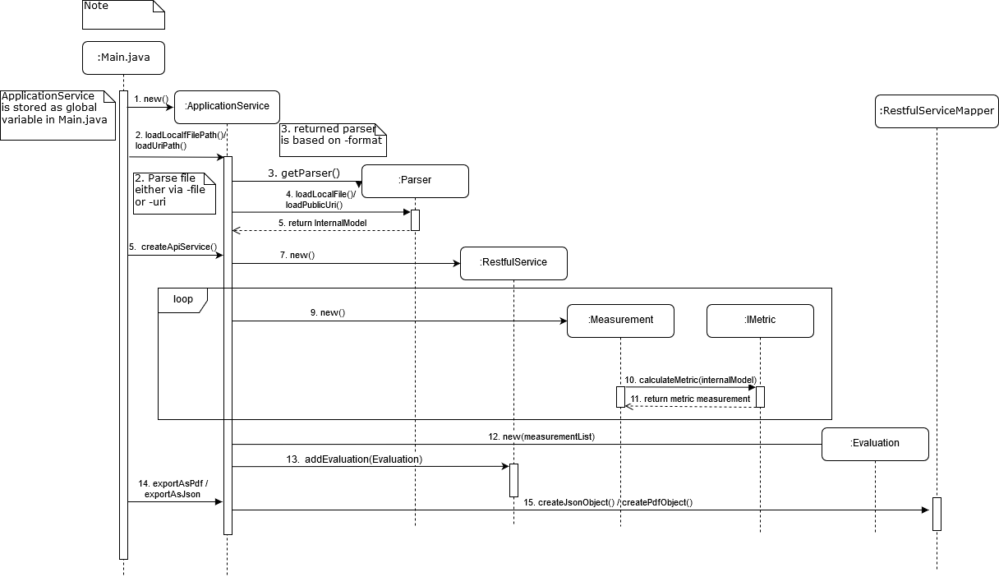
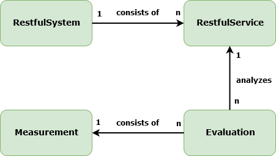

# RAMA CLI Development Guide
> This document contains the most important information for developers who want to understand and extend RAMA.

## General Architecture

### UML Sequence Diagram
Description of the tools behavior if it is started via command-line.


#### Main
Entry point of the tool. Command-line [options](#Command-line Options) are detected and passed to the ApplicationService.

#### ApplicationService
the ApplicationService is responsible for creating:
* RestfulSystem 
* RestfulService
* Evaluation
* Measurement

| Class        | Responsibility   | 
| :-------------|:--------------|
|RestfulSystem|One system can consist of multiple APIs. This entity is used to store the system name and a list of `RestfulServices`. This is not used in the CLI. Can be used in combination with the [other tools](#Other%20Tools).   |
|RestfulService|Represents a single specification file. Can store meta information like name or the file. Also stores a list of `Evaluations`. This entity is later used by the `RestfulServiceMapper` to generate PDF or JSON files.|
|Evaluation|Contains multiple `Measurements` and also other metadata|
|Measurement|Represents the concrete values for a single metric|



#### Parsers
All Parsers inherit from the `Parser.java` class.
The Parser are responsible for transforming specification files from each format to our [Internal API Model](#Internal%20API%20Model)

#### Internal API Model

Each parser has to parse a given api specification into the internal model for the evaluation. The internal model consists of the following eleven classes.
1. SpecificationFile: Contains the meta-information of the file.
2. SpecificationDescriptor: Contains the format and the version of the format of the file.
3. API: Contains the base Path and a Path for each individual endpoint of the API.
4. Path: A Path objected contains the name of the path and a list of all methods the endpoint provides.
5. Method: Each Method object should have its HttpMethod defined and contains a list of all parameters, responses and request bodies the method contains, additionally, an operationID must be provided. Should the API specification language not require a operationID, you can use an incrementing integer for this variable.
6. Parameter: A Parameter object should provide its name as the key (the same value that has been used as key in the parameter map), the data type of the parameter, where the parameter was specified and if the parameter is required or not.
7. Response: Each Response object contains the codes for which the response is send and the possible content media types contained in the response.
8. RequestBody: Each RequestBody object has all the possible content media types it contains.
9. ContentMediaType: Each ContentMediaType object has its media Type as a String and a DataModel object.
10. DataModel: A DataModel object has a data type which is usually either object or array, a map of properties contained in this DataType object, a DataModelRelationship object and a list of sub DataModel objects.
DataModelRelationship are required if the data schema has something like oneOf, allOf or onlyOne. If a data schema has such properties it is required to set the DataModelRelationship and the dataModels map has to be filled.
11. Property: A property has its name as a key(the same value that has been used as key in the parameter map), the data Type of the property, the format of the property, a list of SubProperty objects and it can also contain a DataModel object. Properties, which themself contain more properties have to be listed under sub properties as well. Furthermore, a property contains a boolean which defines whether or not this property can be null and the two int values minOccurs and maxOccurs.
<br> The dataModel of a property is used when the property is defined by a schema that has oneOf, allOf or onlyOne as property.


## How to add new parsers ?

To add a new parser, the `Parser.java` class should be extended. The Parser class provides the two functions loadPublicUrl and loadLocalUrl which return a SpecificationFile object. At least one of these functions should be overridden and used as an entry point for the parser. Furthermore the parser has to parse all relevant information of the given api specification into the returned SpecificationFile object. <br>
Also the `ParserType.java` has to extended with a new ENUM and a new case has to be added to the switch statement

## How to add or modify metrics ?
To extend the tool with additional metrics, the developer has to implement the IMetric interface. The interface contains the important methods which the implemented metric should have.
JUnit-test for new metrics should be implemented and all required specification files for a specific metric test should be copied in its own `src/test/resources/metrics/...` folder so that it is easier to maintain metrics.

In order to use the also available web-app-api project as a backend for the Vue JS frontend, the developer has to make sure that each new metric also has an ini file in the metric-ini folder. Expected are four keys for the section "thresholds" and one key for the section "colorDistribution". In thresholds the developer sets the keys for the absolute color scheme used in the Vue JS frontend. The lower and upper bound of the colors red and green are to be determined. Also, the boolean key "maxGreen" in the section "colorDistribution" determines if the highest value is presented green and the lowest value is presented red or vice versa in the relative color scheme used in the Vue JS frontend.

## How to extend the internal API model ?

To modify the internal model the ProtoBuf file in `src/main/proto` has to be adjusted. While new properties can simply be inserted, new classes have to be definied as a new message. The [official language guide](https://developers.google.com/protocol-buffers/docs/proto3) is a more elaborate starting point to familiarize yourself with ProtoBuf. Currently the proto sources have to be compiled manually, which is done by invoking the [Protocol Compiler](https://developers.google.com/protocol-buffers/docs/downloads.html) as follows:
```
protoc --proto_path=IMPORT_PATH\src\main\proto --java_out=DST_DIR\src\main\java model.proto
```
At a later point this build process should probably be automated via maven.
The generated Java class holds `Builder` factories for all definied messages with the appropiate getters and setters. After an object has been build, it has to be casted back to a builder to allow for further modifications. The [official tutorial](https://developers.google.com/protocol-buffers/docs/javatutorial) is more exhaustive.

It is strongly advised to check all existing metrics for needed adjustments and especially incorporate the updated model into all implemented parsers. This advice stands regardless of if the fact, if made changes technically necessitate adjustments of either parsers or metrics. Only this assiduous approach maintains the correctness of calculated metrics.

## Metrics
The tool currently has 10 metrics that are described as follows:
* [Argument per Operation (APO)](metrics/ArgumentsPerOperation.md)
* [Average Path Length (APL)](metrics/AveragePathLength.md)
* [Biggest Root Coverage (BRC)](metrics/BiggestrootCoverage.md)
* [Data Weight (DW)](metrics/DataWeight.md)
* [Distinct Message Ratio (DMR)](metrics/DistinctMessageRatio.md)
* [Lack of Message Level Cohesion (LoMC)](metrics/LackOfMessageLevelCohesion.md)
* [Longest Path (LP)](metrics/LongestPath.md)
* [Number of Root Resources (NOR)](metrics/NumberOfRoots)
* [Service Interface Data Cohesion (SIDC)](metrics/ServiceInterfaceDataCohesion.md)
* [Weighted Service Interface Count (WSIC)](metrics/WeightedServiceInterfaceCount.md)

## Other Tools
