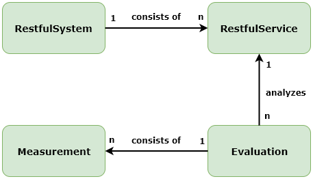

# RAMA CLI Development Guide
> This document contains the most important information for developers who want to understand and extend RAMA.

## General Architecture

### UML Sequence Diagram
Description of the tools behavior if it is started via command-line.

#### Main
Entry point of the tool. Command-line [options](#Command-line Options) are detected and passed to the ApplicationService.

#### ApplicationService
the ApplicationService is responsible for creating:
* RestfulApiSystem 
* RestfulApiService
* Evaluation
* Measurement

| Class        | Responsibility   | 
| :-------------|:--------------|
|RestfulApiSystem|One system can consist of multiple APIs. This entity is used to store the system name and a list of `RestfulApiServices`. This is not used in the CLI. Can be used in combination with the [other tools](#Other%20Tools).   |
|RestfulApiService|Represents a single specification file. Can store meta information like name or the file. Also stores a list of `Evaluations`. This entity is later used by the `RestfulServiceMapper` to generate PDF or JSON files.|
|Evaluation|Contains multiple `Measurements` and also other metadata|
|Measurement|Represents the concrete values for a single metric|

#### Parsers
All Parsers inherit from the `Parser.java` class.
The Parser are responsible for transforming specification files from each format to our [Internal API Model](#Internal%20API%20Model)

#### Internal API Model

Each parser has to parse a given api specification into the internal model for the evaluation. The internal model consists of the following eleven classes.
1. SpecificationFile: Contains the metainformation of the file.
2. SpecificationDescriptor: Contains the format and the version of the format of the file.
3. API: Contains the base Path and a Path for each individual endpoint of the API.
4. Path: A Path objected contains the name of the path and a list of all methods the endpoint provides.
5. Method: Each Method object should have it's HttpMethod defined and contains a list of all paramters, responses and request bodies the method contains, additionally, an operationID must be provided. Should the API specification language not require a operationID, you can use an incrementing integer for this variable.
6. Parameter: A Parameter object should provide it's name as the key (the same value that has been used as key in the paramter map), the data type of the paramter, where the parameter was specified and if the parameter is required or not.
7. Response: Each Response object contains the codes for which the response is send and the possible content media types contained in the response.
8. RequestBody: Each RequestBody object has all the possible content media types it contains.
9. ContentMediaType: Each ContentMediaType object has it's media Type as a String and a DataModel object.
10. DataModel: A DataModel object has a data type which is usually either object or array, a map of properties contained in this DataType object, a DataModelRelationship object and a list of sub DataModel objects.  
11. Property: A property has it's name as a key(the same value that has been used as key in the paramter map), the data Type of the property, the format of the property, a list of SubPorperty objects and it can also contain a DataModel object. Properties, which themself contain more properties have to be listed under sub porperties as well. Furthermore, a property contains a boolean which defines whether or not this property can be null and the two int values minOccures and maxOccurs.

## How to add new parsers?

To add a new parser, the Parser class should be extended. The Parser class provides the two functions loadPublicUrl and loadLocalUrl which return a SpecificationFile object. At least one of these functions should be overriden and used as an entry point for the parser. Furthermore the parser has to parse all relevant information of the given api specification into the returned SpecificationFile object.

## How to add or modify metrics?

## How to add or modify tests?

## Metrics
The tool currently has 10 metrics that are described as follows:
* [Argument per Operation (APO)](metrics/ArgumentsPerOperation.md)
* [Average Path Length (APL)](metrics/AveragePathLength.md)
* [Biggest Root Coverage (BRC)](metrics/BiggestrootCoverage.md)
* [DataWeight (DW)](metrics/DataWeight.md)
* [Longest Path (LP)](metrics/LongestPath.md)
* [Number Of Root Resources (NOR)](metrics/NumberOfRoots)
* [Service Interface Data Cohesion (SIDC)](metrics/ServiceInterfaceDataCohesion.md)
* [Weighted Service Interface Count (WSIC)](metrics/WeightedServiceInterfaceCount.md)

## Other Tools
