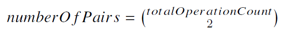
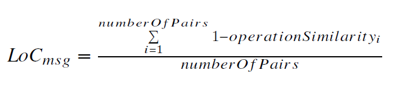
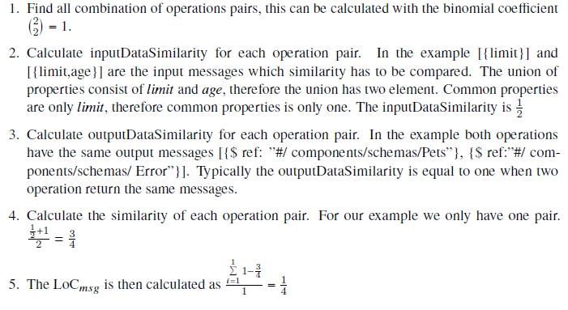

# Lack of Message-Level Cohesion (LoC<sub>msg</sub>)
The Lack of Message-Level Cohesion (LoC<sub>msg</sub>) represents a measure for the cohesion inside an interface. 
The LoC<sub>msg</sub> uses the similarity between two operations by comparing their `input data` with each other and by comparing their `output data` with each other to calculate the cohesion.

* `input data` is the combination of path parameters, query parameters and the request body. The input data can be seen as a single data object which has path parameters, query parameters and the request body as sub-properties.
* `output data` is the combination of all responses. The output data can be seen as a single data object which has all responses as sub-properties.

The similarity of `input data` between two operations and `output data` between two operations is calculated with:

* `inputDataSimilarity  = commonInputDataProperties / unionOfAllInputDataProperties`
* `outputDataSimilarity  = commonOutDataProperties / unionOfAllOutDataProperties`

After that the similarity between operations is calculated with the formula:
`operationSimilarity = (inputDataSimilarity + outputDataSimilarity)`

Finally, for each possible operation pair the following formula is used, whereby the numberOfPairs is the number of all possible operation pairs. The numberOfPairs can be calculated with the binomial coefficient:





## Example calculation
This is an example calculation for the OpenAPI V3 specification that is listed below.


The fictional OpenAPI specification below describes two paths each containing one operation.
```yaml
paths:
    /pets:
        get:
            parameters:
                - name: limit
                  in: query
                  schema:
                    type: integer
            responses:
                '200':
                    description: An array of pets
                    content:
                        application/json:
                            schema:
                                $ref: "#/components/schemas/Pets"
                default:
                    description: unexpected error
                    content:
                        application/json:
                            schema:
                                $ref: "#/components/schemas/Error"

    /pets/{age}:
        get:
            parameters:
                - name: limit
                  in: query
                  schema:
                    type: integer
                - name: age
                  in: path
                  required: true
                  schema:
                    type: integer
            responses:
                '200':
                    description: An array of pets with specified age
                    content:
                        application/json:
                            schema:
                                $ref: "#/components/schemas/Pets"
                default:
                    description: unexpected error
                    content:
                        application/json:
                            schema:
                                $ref: "#/components/schemas/Error"

components:
    schemas:
        Pet:
            properties:
                age:
                    type: integer
                name:
                    type: string

        Pets:
            type: array
            items:
                $ref: "#/components/schemas/Pet"

        Error:
            properties:
                message:
                    type: string
```

## Source

Athanasopoulos, Dionysis, et al. "Cohesion-driven decomposition of service interfaces without access to source code." IEEE Transactions on Services Computing 8.4 (2014): 550-562.